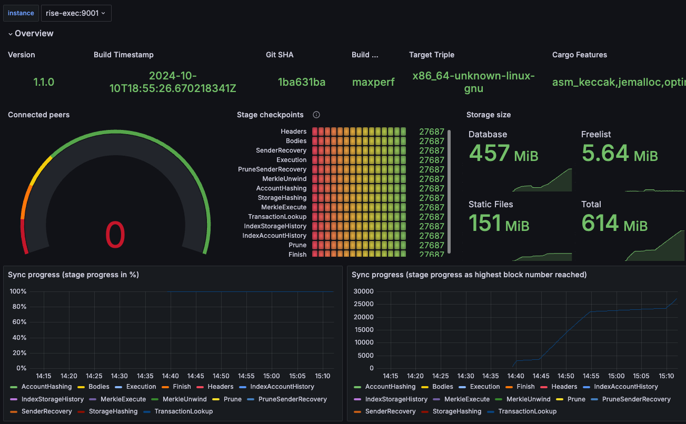

# RISE Node

Blazingly fast Ethereum rollup that reaches 1 Gigagas/s for enormous blocks and is 6~18 times faster than OP.

## Hardware Requirements 
Below are suggested minimum hardware requirements for full node.
- Disk: At least 1TB (NVMe recommended)  
- Memory: 16GB+
- CPU: High clock speeds.

If you're using AWS, we recommend at least `c6id.4xlarge` instance with a 6000 IOPS disk enabled.

## How to run RISE full node.

This guide will help you set up a full node on our Sepolia Testnet.

Generate the jwt token

```sh
$ ./generate-jwt.sh
```

Prepare your config

```sh
$ cp env.example .env
```

Config your Sepolia L1 RPC and local data directory to persist the state data.
```
# .env file
# your config
L1_RPC_URL=
LOCAL_DATA_DIR=./
```

> Note: You can request your L1 provider for the beacon RPC. For example, if you use Quicknode, the `L1_RPC_URL` and `L1_BEACON_URL` will be the same, like: `https://blue-capable-bush.ethereum-sepolia.quiknode.pro/<token>`.

Start the node 

```sh
docker compose -p rise -f docker-compose.yml -f monitor.yml up -d
```

After starting the node, you can monitor your chain via the Grafana dashboard. The default login credentials are:
- username: admin
- password: admin



## Run the full node from snapshot

We take a snapshot of the full node every day at midnight. You can use these snapshots to speed up your node synchronization.

The archive includes the databases for both the execution and consensus layers, specifically `l2_data` and `safedb_data`.

Make sure to download and extract the archive into your node's data directory (default is `./data`). The download link will look like this:
https://storage.googleapis.com/rise-snapshot/rise-sepolia.snapshot.20250410.tar.lz4

The file is named in the format:
`rise-sepolia.snapshot.YYYYmmdd.tar.lz4`
(for example, the snapshot taken on April 10 should be `rise-sepolia.snapshot.20250410.tar.lz4`).
You can also ask our DevOps team for the latest snapshot.

To extract the archive, use the following command:

```shell
cp rise-sepolia.snapshot.20250410.tar.lz4 ./data
tar -I lz4 -xvf rise-sepolia.snapshot.20250410.tar.lz4
rm rise-sepolia.snapshot.20250410.tar.lz4
```
