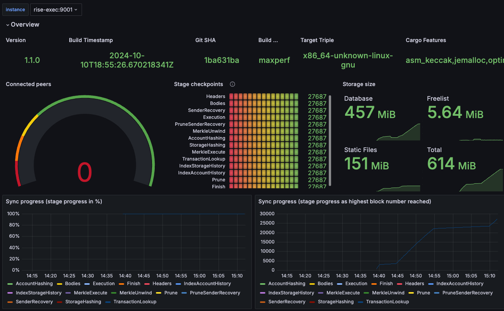

# RISE Node

Run a RISE full node, two ways: **Docker Compose** (quickest, bundled monitoring) or **native systemd** (no docker — how RISE's own replicas run).

## Requirements


|                   | Mainnet                                                 | Testnet                      |
| ----------------- | ------------------------------------------------------- | ---------------------------- |
| Disk (local NVMe) | **3TB**                                                 | **6TB**                      |
| RAM               | **128GB** (64GB min)                                    | 32GB+                        |
| CPU               | 16 cores, >= 3.5GHz boost (per-core speed > core count) | same                         |


- **Local NVMe only** — network volumes (AWS EBS, GCP Hyperdisk/PD) are too slow regardless of IOPS. 
- Reference shapes (what RISE runs): 
  - AWS `i8g.4xlarge` 
  - GCP `z3-highmem-14-standardlssd` 
  - Bare-metal EPYC 9135 / 128GB / 2×1.92TB NVMe RAID0. 
  - Local SSD is ephemeral — if the VM is lost, re-restore from snapshot.
- **L1 RPC without rate limits** (Sepolia for testnet, Ethereum for mainnet) — best is your own L1 node. A throttled endpoint keeps derivation below chain speed: the node **falls behind forever**. With a paid provider, set `L1_RPC_KIND=<provider>` (+ `L1_TRUST_RPC=true`) in `.env`.
- **Firewall**: open `30003/tcp` (P2P). Block `8545`/`8546` unless serving RPC. Docker: also block `3000` (Grafana admin/admin), `9090` (Prometheus, no auth), `9001`/`7300`.


## OS support (native)

Requires **glibc >= 2.30** (installer checks). `amd64` + `arm64`.


| OS                                          | glibc       | Native              |
| ------------------------------------------- | ----------- | ------------------- |
| Ubuntu 24.04                                | 2.39        | ✅ (recommended)     |
| Ubuntu 22.04 / 20.04                        | 2.35 / 2.31 | ✅                   |
| Amazon Linux 2023                           | 2.34        | ✅                   |
| CentOS Stream 9 / RHEL 9 / Rocky 9 / Alma 9 | 2.34        | ✅                   |
| CentOS Stream 8 / RHEL 8                    | 2.28        | ❌ Docker only       |
| CentOS 7                                    | 2.17        | ❌ Docker only (EOL) |


## 1. Configure

```sh
cp env.example .env   # set L1_RPC_URL and NETWORK (testnet | mainnet)
```

Peers, DA, version pins, tuning live in the git-managed `env.testnet` / `env.mainnet` — don't copy them into `.env`.

**Upgrading from the old README?** It used to say `cp env.mainnet .env` — such a `.env` shadows every future preset update (peer rotations, DA moves, version bumps). Recreate it from `env.example`, keeping only your own values (`L1_RPC_URL`, `NETWORK`). Docker users must also switch to the new `--env-file` invocation (section 3a) — the old bare `docker compose -p rise ... up -d` now fails fast instead of silently interpolating empty values.

## 2. Snapshot — mainnet, BEFORE first start

Daily: `https://snapshot.mainnet.risechain.com/rise-mainnet.snapshot_{YYYYMMDD}.tar.zst` (yesterday always exists). Contains `l2_data` + `safedb_data` — extract directly under your data dir. Testnet: no snapshot, syncs from genesis.

```sh
apt install -y zstd aria2   # dnf: zstd only (aria2 needs EPEL; streaming needs neither)

# streaming (no space needed for the archive):
mkdir -p /mnt/data && cd /mnt/data
curl -sL https://snapshot.mainnet.risechain.com/rise-mainnet.snapshot_20260822.tar.zst | tar -I zstd -x

# or resumable download (~875GB extra space):
aria2c -o snap.tar.zst -s14 -x14 -k100M <url> && tar -I zstd -xvf snap.tar.zst
```

Switching from a genesis-synced node: stop it, delete `l2_data` + `safedb_data`, extract, start.

## 3a. Run with Docker

```sh
./generate-jwt.sh
# use env.mainnet for mainnet; needs docker compose >= 2.17
docker compose --env-file env.testnet --env-file .env -p rise -f docker-compose.yml -f monitor.yml up -d
```

Grafana at `:3000` (admin/admin).



## 3b. Run native (systemd)

Switching from docker on the same host? Stop the docker stack first — it holds ports 8545/30003 (the installer refuses to start over it):

```sh
docker compose -p rise -f docker-compose.yml -f monitor.yml down
```

```sh
sudo ./scripts/install.sh --network testnet --data-dir /mnt/data
```

Pulls the pinned binaries from public ECR, verifies them (sha256 + arch + libs), installs systemd units, starts, health-checks. Versions live under `/opt/rise-node/versions/`, activated via symlink. Re-runs remember network/data-dir/L1. `--no-start` stages without starting; `--l1-rpc <url>` overrides `.env`.

```sh
riseops                                    # versions · service state · sync status
systemctl start|stop rise-replica.target   # whole stack
journalctl -u rise-exec -f                 # logs (or -u rise-node)
```

`lagging`/`STALLED` is expected until the node reaches the tip. Metrics are loopback-only; `monitor.yml` is docker-only.

## Upgrade / rollback

Release info (version pins, chain files, unit flags) ships via git:

```sh
git pull --ff-only
sudo ./scripts/install.sh          # native — restarts only if something changed
```

```sh
git pull --ff-only                 # docker — use env.mainnet for mainnet
docker compose --env-file env.testnet --env-file .env -p rise -f docker-compose.yml -f monitor.yml up -d
```

**Rollback / run any version (native)** — pin a tag in `.env` and re-run (remove the pin when done, it freezes upgrades). Use the base tag (`sha-xxxxxxx`) — the installer appends `-amd64`/`-arm64` itself (and strips one if you paste it). Tags: [rise-exec/replica-bin](https://gallery.ecr.aws/risechain/risechain-public/rise-exec/replica-bin) · [rise-op-node-bin](https://gallery.ecr.aws/risechain/risechain-public/rise-op-node-bin).

```sh
echo 'RISE_EXEC_TAG=<tag>' >> .env    # and/or RISE_NODE_TAG=<tag>
sudo ./scripts/install.sh
```

Emergency (version already on disk):

```sh
ln -sfn /opt/rise-node/versions/rise-exec/<tag>/rise-exec /opt/rise-node/bin/rise-exec
systemctl restart rise-replica.target
```

Rollback doesn't downgrade the database — if the newer version migrated the datadir, restore a snapshot.

## Ports


| Port        | What          | Bind                         |
| ----------- | ------------- | ---------------------------- |
| 8545 / 8546 | HTTP RPC / WS | 0.0.0.0 — firewall as needed |
| 30003       | P2P           | open publicly                |
| 7545        | op-node RPC   | loopback only                |
| 9001 / 7300 | metrics       | loopback only (native)       |


